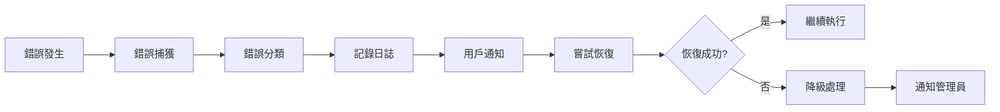

# 錯誤處理手冊

> 🛡️ **錯誤處理標準手冊**：為 Streaming Overlay System 專案提供完整的錯誤處理策略和解決方案

## 🎯 錯誤處理核心原則

### 📋 **基本處理原則**
- **預防優於治療** - 主動預防錯誤發生
- **優雅降級** - 錯誤發生時保持系統可用性
- **用戶友善** - 提供清晰的錯誤訊息和解決建議
- **快速恢復** - 建立快速診斷和恢復機制
- **學習改進** - 從錯誤中學習並持續改進

### 🔄 **錯誤處理流程**


## 🚨 **錯誤分類系統**

### 🔴 **嚴重錯誤 (Critical)**
```markdown
影響：系統無法正常運行
處理：立即停止相關功能，通知管理員
範例：
- 資料庫連接完全失敗
- 認證系統崩潰
- 金流處理系統錯誤
```

### 🟡 **重要錯誤 (Major)**
```markdown
影響：核心功能受影響但系統可運行
處理：啟用降級模式，記錄詳細日誌
範例：
- 第三方 API 服務暫時不可用
- WebSocket 連接中斷
- 快取系統故障
```

### 🟢 **一般錯誤 (Minor)**
```markdown
影響：部分功能受影響
處理：記錄錯誤，提供替代方案
範例：
- 圖片載入失敗
- 非關鍵 API 調用失敗
- UI 組件渲染問題
```

### 🔵 **警告 (Warning)**
```markdown
影響：潛在問題，不影響當前功能
處理：記錄警告，監控趨勢
範例：
- API 響應時間過長
- 記憶體使用率偏高
- 用戶輸入格式異常
```

## 🔧 **模組特定錯誤處理**

### 🏗️ **01-基礎系統架構錯誤**

#### 環境配置錯誤
```javascript
// 錯誤處理範例
try {
  const config = await loadConfiguration();
} catch (error) {
  console.error('Configuration loading failed:', error);
  // 使用預設配置
  const config = getDefaultConfiguration();
  logWarning('Using default configuration due to loading failure');
}
```

#### 服務啟動錯誤
```javascript
// 服務啟動錯誤處理
const startServer = async () => {
  try {
    await server.listen(PORT);
    console.log(`Server started on port ${PORT}`);
  } catch (error) {
    console.error('Server startup failed:', error);
    // 嘗試使用備用端口
    const backupPort = PORT + 1;
    try {
      await server.listen(backupPort);
      console.log(`Server started on backup port ${backupPort}`);
    } catch (backupError) {
      console.error('Backup server startup also failed:', backupError);
      process.exit(1);
    }
  }
};
```

### 🔄 **02-即時通訊系統錯誤**

#### WebSocket 連接錯誤
```javascript
// WebSocket 錯誤處理
const handleWebSocketError = (ws, error) => {
  console.error('WebSocket error:', error);
  
  // 錯誤分類處理
  if (error.code === 'ECONNRESET') {
    // 連接重置，嘗試重連
    scheduleReconnection(ws);
  } else if (error.code === 'ETIMEDOUT') {
    // 連接超時
    logWarning('WebSocket connection timeout');
    ws.close();
  } else {
    // 其他錯誤
    logError('Unexpected WebSocket error', error);
    ws.close();
  }
};

// 自動重連機制
const scheduleReconnection = (ws, attempt = 1) => {
  const delay = Math.min(1000 * Math.pow(2, attempt), 30000); // 指數退避
  
  setTimeout(() => {
    try {
      ws.reconnect();
    } catch (error) {
      if (attempt < 5) {
        scheduleReconnection(ws, attempt + 1);
      } else {
        logError('Max reconnection attempts reached');
      }
    }
  }, delay);
};
```

### 🎥 **03-05-平台整合錯誤**

#### YouTube API 錯誤處理
```javascript
// YouTube API 錯誤處理
const handleYouTubeAPIError = async (error, operation) => {
  const { status, message } = error.response || {};
  
  switch (status) {
    case 401:
      // 認證錯誤
      logError('YouTube API authentication failed');
      await refreshAccessToken();
      break;
      
    case 403:
      // 配額超限
      logWarning('YouTube API quota exceeded');
      enableRateLimiting();
      break;
      
    case 404:
      // 資源不存在
      logWarning(`YouTube resource not found for operation: ${operation}`);
      return null;
      
    case 500:
      // 服務器錯誤
      logError('YouTube API server error');
      scheduleRetry(operation);
      break;
      
    default:
      logError(`Unexpected YouTube API error: ${status} - ${message}`);
  }
};
```

#### Twitch API 錯誤處理
```javascript
// Twitch API 錯誤處理
const handleTwitchAPIError = (error, context) => {
  if (error.status === 429) {
    // 速率限制
    const retryAfter = error.headers['retry-after'] || 60;
    logWarning(`Twitch API rate limited, retry after ${retryAfter}s`);
    scheduleRetry(context.operation, retryAfter * 1000);
  } else if (error.status >= 500) {
    // 服務器錯誤
    logError('Twitch API server error', error);
    enableFallbackMode();
  }
};
```

### 💰 **06-07-金流系統錯誤**

#### 支付處理錯誤
```javascript
// 支付錯誤處理 - 最高安全等級
const handlePaymentError = async (error, transactionData) => {
  // 立即記錄詳細錯誤
  logCritical('Payment processing error', {
    error: error.message,
    transactionId: transactionData.id,
    amount: transactionData.amount,
    timestamp: new Date().toISOString()
  });
  
  // 根據錯誤類型處理
  switch (error.type) {
    case 'card_error':
      // 信用卡錯誤
      return {
        success: false,
        message: '支付卡片資訊有誤，請檢查後重試',
        userMessage: true
      };
      
    case 'rate_limit_error':
      // 請求過於頻繁
      return {
        success: false,
        message: '請求過於頻繁，請稍後再試',
        retryAfter: 5000
      };
      
    case 'api_error':
      // API 錯誤
      logCritical('Payment API error - manual review required');
      return {
        success: false,
        message: '支付系統暫時不可用，請聯繫客服',
        requiresManualReview: true
      };
      
    default:
      // 未知錯誤
      logCritical('Unknown payment error - immediate attention required');
      return {
        success: false,
        message: '支付處理異常，請聯繫客服',
        requiresImmediateAttention: true
      };
  }
};
```

### 🔐 **08-系統管理錯誤**

#### 權限驗證錯誤
```javascript
// 權限錯誤處理
const handleAuthorizationError = (req, res, error) => {
  logWarning('Authorization failed', {
    userId: req.user?.id,
    resource: req.path,
    method: req.method,
    error: error.message
  });
  
  // 根據錯誤類型返回適當響應
  if (error.type === 'token_expired') {
    res.status(401).json({
      error: 'Token expired',
      message: '登入已過期，請重新登入',
      action: 'redirect_to_login'
    });
  } else if (error.type === 'insufficient_permissions') {
    res.status(403).json({
      error: 'Insufficient permissions',
      message: '您沒有權限執行此操作',
      requiredPermission: error.requiredPermission
    });
  } else {
    res.status(401).json({
      error: 'Authentication failed',
      message: '身份驗證失敗，請重新登入'
    });
  }
};
```

## 🔍 **錯誤監控和診斷**

### 📊 **日誌記錄標準**

#### 日誌等級定義
```javascript
const LogLevel = {
  CRITICAL: 0, // 系統崩潰級別
  ERROR: 1,    // 錯誤但系統可繼續運行
  WARNING: 2,  // 警告，需要注意
  INFO: 3,     // 一般資訊
  DEBUG: 4     // 調試資訊
};

// 結構化日誌格式
const logError = (message, error, context = {}) => {
  const logEntry = {
    timestamp: new Date().toISOString(),
    level: 'ERROR',
    message,
    error: {
      name: error.name,
      message: error.message,
      stack: error.stack
    },
    context,
    sessionId: context.sessionId,
    userId: context.userId,
    requestId: context.requestId
  };
  
  console.error(JSON.stringify(logEntry));
  
  // 發送到監控系統
  if (process.env.NODE_ENV === 'production') {
    sendToMonitoring(logEntry);
  }
};
```

### 🚨 **告警機制**

#### 告警觸發條件
```javascript
const AlertConditions = {
  // 錯誤率告警
  errorRate: {
    threshold: 0.05, // 5% 錯誤率
    timeWindow: 300, // 5分鐘內
    action: 'sendAlert'
  },
  
  // 響應時間告警
  responseTime: {
    threshold: 5000, // 5秒
    consecutiveCount: 10,
    action: 'sendWarning'
  },
  
  // 系統資源告警
  systemResource: {
    memory: 0.9, // 90% 記憶體使用率
    cpu: 0.8,    // 80% CPU 使用率
    action: 'sendCriticalAlert'
  }
};
```

## 🔄 **恢復策略**

### 🚀 **自動恢復機制**

#### 服務健康檢查
```javascript
// 健康檢查和自動恢復
const healthCheck = async () => {
  const services = ['database', 'redis', 'youtube-api', 'twitch-api'];
  const healthStatus = {};
  
  for (const service of services) {
    try {
      healthStatus[service] = await checkServiceHealth(service);
    } catch (error) {
      healthStatus[service] = {
        status: 'unhealthy',
        error: error.message,
        lastCheck: new Date().toISOString()
      };
      
      // 嘗試自動恢復
      await attemptServiceRecovery(service);
    }
  }
  
  return healthStatus;
};

// 服務恢復策略
const attemptServiceRecovery = async (service) => {
  const recoveryStrategies = {
    database: async () => {
      // 重新建立資料庫連接
      await reconnectDatabase();
    },
    redis: async () => {
      // 重新連接 Redis
      await reconnectRedis();
    },
    'youtube-api': async () => {
      // 刷新 API Token
      await refreshYouTubeToken();
    },
    'twitch-api': async () => {
      // 重新認證 Twitch
      await reauthenticateTwitch();
    }
  };
  
  if (recoveryStrategies[service]) {
    try {
      await recoveryStrategies[service]();
      logInfo(`Service ${service} recovered successfully`);
    } catch (error) {
      logError(`Failed to recover service ${service}`, error);
    }
  }
};
```

### 🛡️ **降級處理策略**

#### 功能降級配置
```javascript
const FallbackStrategies = {
  // YouTube 數據獲取降級
  youtubeData: {
    primary: 'realtime-api',
    fallback: 'cached-data',
    lastResort: 'static-placeholder'
  },
  
  // 即時通訊降級
  realTimeComm: {
    primary: 'websocket',
    fallback: 'server-sent-events',
    lastResort: 'polling'
  },
  
  // 支付處理降級
  payment: {
    primary: 'stripe',
    fallback: 'paypal',
    lastResort: 'manual-processing'
  }
};

// 降級處理實現
const handleServiceDegradation = async (service, error) => {
  const strategy = FallbackStrategies[service];
  
  if (strategy) {
    logWarning(`Service ${service} degraded, switching to fallback`);
    
    try {
      return await useFallbackStrategy(service, strategy.fallback);
    } catch (fallbackError) {
      logError(`Fallback also failed for ${service}`, fallbackError);
      return await useFallbackStrategy(service, strategy.lastResort);
    }
  }
};
```

## 📋 **錯誤處理檢查清單**

### 🔍 **開發階段檢查**
- [ ] 所有 API 調用都有錯誤處理
- [ ] 資料庫操作包含事務回滾
- [ ] 用戶輸入驗證和清理
- [ ] 敏感操作有額外驗證
- [ ] 錯誤訊息不洩露敏感資訊

### 🧪 **測試階段檢查**
- [ ] 錯誤情境的單元測試
- [ ] 網路中斷情況測試
- [ ] 高負載下的錯誤處理
- [ ] 資料庫連接失敗測試
- [ ] 第三方服務不可用測試

### 🚀 **部署階段檢查**
- [ ] 監控和告警系統配置
- [ ] 日誌收集和分析設置
- [ ] 錯誤通知機制測試
- [ ] 備份和恢復程序驗證
- [ ] 降級策略可用性確認

## 🎯 **用戶體驗優化**

### 💬 **錯誤訊息設計原則**

#### 用戶友善的錯誤訊息
```javascript
const UserFriendlyMessages = {
  // 技術錯誤 -> 用戶友善訊息
  'ECONNREFUSED': '無法連接到服務器，請檢查網路連接',
  'ETIMEDOUT': '請求超時，請稍後再試',
  'ENOTFOUND': '找不到請求的資源',
  'VALIDATION_ERROR': '輸入資料格式不正確，請檢查後重新輸入',
  'AUTHENTICATION_FAILED': '登入失敗，請檢查帳號密碼',
  'INSUFFICIENT_PERMISSIONS': '您沒有權限執行此操作',
  'RATE_LIMIT_EXCEEDED': '操作過於頻繁，請稍後再試'
};

// 錯誤訊息轉換
const getUserFriendlyMessage = (error) => {
  const technicalMessage = error.code || error.type || error.message;
  return UserFriendlyMessages[technicalMessage] || '系統發生未知錯誤，請聯繫客服';
};
```

### 🔄 **錯誤恢復引導**
```javascript
// 提供恢復建議
const getRecoveryActions = (error) => {
  const actions = {
    'NETWORK_ERROR': [
      '檢查網路連接',
      '重新整理頁面',
      '稍後再試'
    ],
    'AUTHENTICATION_ERROR': [
      '重新登入',
      '清除瀏覽器快取',
      '聯繫客服'
    ],
    'VALIDATION_ERROR': [
      '檢查輸入格式',
      '參考範例格式',
      '重新填寫表單'
    ]
  };
  
  return actions[error.type] || ['重新整理頁面', '聯繫客服'];
};
```

## 📊 **錯誤分析和改進**

### 📈 **錯誤統計分析**
```javascript
// 錯誤統計收集
const ErrorAnalytics = {
  // 錯誤頻率統計
  trackErrorFrequency: (error) => {
    const key = `error:${error.type}:${error.code}`;
    incrementCounter(key);
  },
  
  // 錯誤趨勢分析
  analyzeErrorTrends: () => {
    // 分析錯誤發生模式
    // 識別問題熱點
    // 生成改進建議
  },
  
  // 用戶影響評估
  assessUserImpact: (error) => {
    // 計算受影響用戶數
    // 評估功能可用性
    // 估算業務影響
  }
};
```

### 🔄 **持續改進流程**
```markdown
1. 錯誤收集和分類
2. 根本原因分析
3. 解決方案設計
4. 實施和測試
5. 效果評估
6. 文檔更新
```

---

## 🎯 總結

此錯誤處理手冊提供了 Streaming Overlay System 專案的完整錯誤處理策略，包括：

- ✅ **分層錯誤處理** - 從預防到恢復的完整流程
- ✅ **模組化處理策略** - 針對不同模組的專門處理
- ✅ **自動恢復機制** - 減少人工干預需求
- ✅ **用戶體驗優化** - 友善的錯誤訊息和恢復引導
- ✅ **持續改進機制** - 從錯誤中學習和優化

遵循此手冊，能夠建立穩健可靠的系統，提供優秀的用戶體驗。

---

*此文檔遵循 Universal AI Vibe Coding 文檔標準 v2.0*
