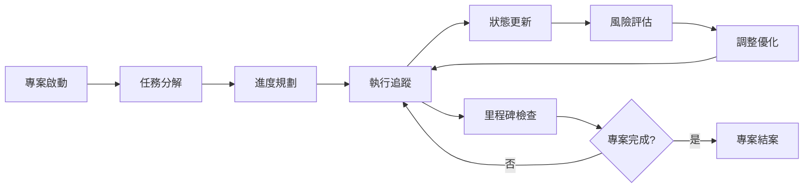

# 進度控管系統指南

> 📊 **專案進度管理完整指南**：為 Streaming Overlay System 專案提供標準化的進度控管系統和 AI 協作機制

## 🎯 進度管理核心理念

### 📋 **管理原則**
- **透明化追蹤** - 所有進度狀態清晰可見
- **AI 自主管理** - AI 能夠自主更新和維護進度
- **里程碑導向** - 以可交付成果為導向
- **風險預警** - 主動識別和處理風險
- **持續優化** - 基於數據持續改進流程

### 🔄 **進度管理流程**


## 🏗️ **五層任務分解架構**

### 📊 **任務層級定義**
```markdown
專案 (Project)
├── 階段 (Phase) - M1, M2, M3, M4, M5
│   ├── 模組 (Module) - 功能群組
│   │   ├── 功能 (Feature) - 具體功能
│   │   │   ├── 任務 (Task) - T1.1, T1.2...
│   │   │   └── 子任務 (Subtask) - 可執行單位
```

### 🎯 **Streaming Overlay System 任務分解範例**

#### 📊 **專案層級**
```markdown
專案名稱: Streaming Overlay System
專案目標: 建立完整的直播疊加系統
預計工期: 8-12 週
主要交付物: 可運行的直播疊加系統
```

#### 🚀 **階段層級 (5個主要階段)**
```markdown
M1: 基礎建設階段 (Week 1-2)
├── 專案架構建立
├── 開發環境設置
└── 基礎服務配置

M2: 核心通訊階段 (Week 2-3)
├── WebSocket 系統
├── 即時資料同步
└── 連接管理機制

M3: 平台整合階段 (Week 3-6)
├── YouTube 整合
├── Twitch 整合
└── API 管理系統

M4: 金流系統階段 (Week 6-8)
├── 支付整合
├── 斗內進度系統
└── 安全性實施

M5: 管理功能階段 (Week 8-10)
├── 用戶權限系統
├── 系統監控
└── 進階功能
```

#### 🔧 **模組層級範例 (M1-基礎建設)**
```markdown
M1.1: 專案架構模組
├── 前端架構設計
├── 後端架構設計
└── 資料庫設計

M1.2: 開發環境模組
├── 本地開發環境
├── 雲端開發環境
└── CI/CD 流程

M1.3: 基礎服務模組
├── 認證服務
├── 日誌服務
└── 監控服務
```

#### ⚙️ **功能層級範例 (M1.1-專案架構)**
```markdown
F1.1.1: 前端架構設計
├── React 專案結構
├── 狀態管理設計
└── 路由系統設計

F1.1.2: 後端架構設計
├── Express 服務架構
├── API 設計規範
└── 中介軟體設計

F1.1.3: 資料庫設計
├── 資料模型設計
├── 關聯關係設計
└── 索引優化設計
```

#### 📝 **任務層級範例 (F1.1.1-前端架構)**
```markdown
T1.1.1.1: React 專案結構建立
├── 建立專案目錄結構
├── 配置 package.json
└── 設置基礎組件架構

T1.1.1.2: 狀態管理實施
├── 安裝 Redux Toolkit
├── 建立 Store 結構
└── 實施狀態切片

T1.1.1.3: 路由系統建立
├── 安裝 React Router
├── 配置路由結構
└── 實施路由守衛
```

## 🏷️ **標準任務分類系統**

### 📊 **任務分類定義**
| 分類 | 圖示 | 優先級 | 說明 | 範例 |
|------|------|--------|------|------|
| **🏗️ 基礎建設** | 🔴🟡🟢 | 高 | 專案基礎架構和環境設定 | 專案結構、開發環境 |
| **⚙️ 核心功能** | 🔴🟡🟢 | 高 | 主要業務邏輯實現 | 用戶管理、資料處理 |
| **🎨 介面開發** | 🔴🟡🟢 | 中 | 前端 UI/UX 實現 | 頁面設計、互動功能 |
| **🔒 安全配置** | 🔴🟡 | 高 | 安全規則和權限設定 | 認證系統、資料加密 |
| **🚀 部署上線** | 🔴🟡 | 中 | 部署和發佈相關 | 環境配置、域名設定 |
| **🧪 測試驗證** | 🟡🟢 | 中 | 功能測試和品質保證 | 單元測試、整合測試 |
| **📚 文檔撰寫** | 🟢 | 低 | 技術文檔和使用指南 | API 文檔、用戶手冊 |

### 🎯 **優先級與狀態系統**

#### 🔥 **優先級標準**
```markdown
🔥 緊急 (Critical): 阻礙其他任務的關鍵問題
├── 立即處理，最高優先級
├── 通常涉及系統崩潰或安全問題
└── 需要在 24 小時內解決

🔴 高 (High): 重要功能或里程碑任務
├── 優先安排，影響專案進度
├── 通常是核心功能或基礎建設
└── 需要在計劃時間內完成

🟡 中 (Medium): 一般功能開發任務
├── 按計劃執行，正常優先級
├── 通常是功能實現或介面開發
└── 可以適度調整時間

🟢 低 (Low): 優化改進或非核心功能
├── 有空時處理，可延後執行
├── 通常是文檔或優化任務
└── 不影響核心功能交付
```

#### 📊 **狀態標準**
```markdown
⏳ 待開始 (Pending): 任務已規劃但尚未開始
├── 等待前置條件滿足
├── 資源分配待確認
└── 依賴任務未完成

🔄 進行中 (In Progress): 任務正在執行中
├── 已開始執行
├── 有明確的負責人
└── 預期完成時間明確

⚠️ 待驗證 (Review): 任務完成待確認
├── 功能已實現
├── 等待測試或審查
└── 需要用戶或同事確認

✅ 已完成 (Completed): 任務已完成並驗證
├── 功能正常運作
├── 通過所有測試
└── 已交付並驗收

⏸️ 已暫停 (Paused): 任務暫時停止
├── 遇到阻礙或依賴問題
├── 等待外部條件
└── 計劃恢復時間

❌ 已取消 (Cancelled): 任務不再需要
├── 需求變更
├── 技術方案調整
└── 資源重新分配
```

## 📊 **進度追蹤系統**

### 🗂️ **標準進度文檔結構**

#### 📋 **主進度文檔 (PROJECT_PROGRESS_TRACKER.md)**
```markdown
# 📊 PROJECT PROGRESS TRACKER - 專案進度追蹤器

## 🚨 AI 執行指令
[AI 優先執行規則和檢查清單]

## 📅 最後更新記錄
[更新時間、更新者、更新原因]

## 🎯 當前專案狀態
[CURRENT_STATUS、完成度、主要成就、下一階段]

## 📋 詳細進度記錄
### 🟢 已完成項目 (COMPLETED)
### 🟡 進行中項目 (IN_PROGRESS)  
### 🔴 待辦事項 (PENDING_TASKS)

## 🎯 下次執行重點
[NEXT_ACTION_ITEMS、建議詢問用戶的問題]

## 📊 專案統計
[完成度統計、時間記錄]

## 🔄 變更歷史
[詳細的變更記錄]

## 🤖 AI 執行備註
[重要提醒、執行策略]
```

#### 🤖 **AI 執行記錄系統**
```markdown
.ai-execution-log/
├── current-progress.md          # 當前執行進度
├── execution-history.md         # 完整執行歷史
├── pending-tasks.md            # 待處理任務清單
├── completed-tasks.md          # 已完成任務記錄
├── issues-tracker.md           # 問題追蹤記錄
└── next-session-plan.md        # 下次執行計畫
```

### 📊 **current-progress.md 標準模板**
```markdown
# AI 執行進度記錄

> 🤖 **AI 自動更新**：每次執行結束時必須更新此記錄
> 📅 **最後更新**：[YYYY-MM-DD HH:MM:SS]

## 🎯 專案基本資訊
- **專案名稱**：Streaming Overlay System
- **專案類型**：Web 應用系統
- **開始日期**：[YYYY-MM-DD]
- **當前階段**：[M1-M5] - [階段名稱]

## 📊 整體進度狀況
- **完成度**：[X]% 
- **當前狀態**：🔄 進行中 | ⏸️ 暫停 | ✅ 完成 | ❌ 中止
- **預計完成**：[YYYY-MM-DD]

## 🔄 當前執行狀態

### ✅ 已完成的任務
- [YYYY-MM-DD HH:MM] ✅ [具體任務描述] - [驗證結果]

### 🔄 正在進行的任務
- **任務名稱**：[具體任務描述]
- **開始時間**：[YYYY-MM-DD HH:MM]
- **執行進度**：[X]%
- **下一步動作**：[具體下一步描述]
- **預期完成**：[YYYY-MM-DD HH:MM]

### ⏳ 待處理任務
1. **[優先級]** [任務描述] - [預估時間]

## ⚠️ 當前問題與阻礙
- **問題1**：[問題描述] - [影響程度] - [解決方案]

## 🎯 下次執行重點
1. **首要任務**：[具體任務描述]
2. **驗證項目**：[需要驗證的內容]
3. **注意事項**：[特別需要注意的事項]

## 📝 AI 執行備註
- [重要決策記錄]
- [特殊處理方式記錄]
- [用戶特殊要求記錄]
```

## 🤖 **AI 執行工作流程標準**

### 📋 **每次執行開始時的檢查清單**
```markdown
🤖 AI 必須執行的開始檢查：

1. 📖 讀取進度記錄
   - [ ] 檢查 PROJECT_PROGRESS_TRACKER.md 主進度文檔
   - [ ] 檢查 current-progress.md AI 執行記錄
   - [ ] 確認最後更新時間和執行狀態
   - [ ] 了解當前里程碑進度和待處理任務
   - [ ] 檢查風險管理和問題追蹤狀態

2. 🔍 狀態確認
   - [ ] 向用戶確認：「我看到上次執行到 [具體里程碑/任務]，當前進度 [X%]，是否從此處繼續？」
   - [ ] 確認是否有新的需求或變更
   - [ ] 檢查是否有未解決的問題需要處理
   - [ ] 確認當前優先級任務和時間安排

3. 📋 任務規劃
   - [ ] 確認本次執行的目標和範圍
   - [ ] 根據優先級系統更新任務順序
   - [ ] 更新任務時間估算和里程碑進度
   - [ ] 制定本次執行計畫和驗收標準
```

### ✅ **每次執行結束時的更新標準**
```markdown
🤖 AI 必須執行的結束更新：

1. 📊 主進度文檔更新
   - [ ] 更新 PROJECT_PROGRESS_TRACKER.md 中的任務狀態
   - [ ] 更新里程碑完成度和整體進度百分比
   - [ ] 記錄每日進度和完成的具體任務
   - [ ] 更新風險管理和問題追蹤狀態
   - [ ] 添加遇到的問題和解決方案

2. 📊 AI 執行記錄更新
   - [ ] 更新 current-progress.md 中的完成任務
   - [ ] 記錄當前執行狀態和下一步計畫
   - [ ] 更新技術決策和實現細節

3. 📝 歷史記錄
   - [ ] 在 execution-history.md 中添加本次執行記錄
   - [ ] 記錄重要決策和解決的問題
   - [ ] 更新時間戳記和執行摘要
   - [ ] 記錄效率分析和時間對比

4. 🎯 下次準備
   - [ ] 更新 next-session-plan.md
   - [ ] 標記需要用戶確認的事項
   - [ ] 預告下次執行的重點和注意事項
   - [ ] 更新任務優先級和依賴關係
```

## 🎯 **AI 自主決策標準**

### 🔄 **繼續執行的條件**
```markdown
AI 可以直接繼續執行的情況：
✅ 進度記錄清晰且無衝突
✅ 沒有需要用戶確認的重大變更
✅ 當前任務在預期範圍內
✅ 沒有阻礙性問題需要解決
✅ 技術方案明確可行
✅ 資源和權限充足
```

### ⚠️ **需要用戶確認的情況**
```markdown
AI 必須向用戶確認的情況：
🔴 發現進度記錄與用戶期望不符
🔴 遇到需要重大架構決策的問題
🔴 發現可能影響整體專案的風險
🔴 用戶環境或需求發生變化
🔴 執行時間超過預期需要調整計畫
🔴 需要額外資源或權限
🔴 技術方案需要重大調整
```

### 🚨 **風險預警機制**
```markdown
AI 需要主動預警的情況：
⚠️ 任務執行時間超過預估 50%
⚠️ 依賴的外部服務出現問題
⚠️ 技術難度超出預期
⚠️ 資源使用率接近上限
⚠️ 關鍵路徑任務出現延遲
⚠️ 品質指標低於標準
```

## 📊 **進度追蹤指標標準**

### 🎯 **量化指標**
```markdown
AI 需要追蹤的關鍵指標：

📈 進度指標
- **任務完成率**：已完成任務數 / 總任務數
- **里程碑達成率**：已完成里程碑 / 總里程碑數
- **時間效率**：實際用時 / 預估用時
- **進度偏差率**：(實際進度 - 計劃進度) / 計劃進度

🔧 品質指標
- **問題解決率**：已解決問題數 / 總問題數
- **代碼品質分數**：基於代碼審查的評分
- **測試覆蓋率**：測試覆蓋的代碼比例
- **缺陷密度**：發現缺陷數 / 代碼行數

👥 協作指標
- **用戶滿意度**：基於用戶回饋的評分
- **溝通效率**：問題解決的平均回合數
- **決策速度**：重要決策的平均時間
- **文檔完整性**：文檔覆蓋的功能比例
```

### 📈 **質化指標**
```markdown
AI 需要評估的質量指標：

🎯 執行品質
- **執行流暢度**：任務間的銜接是否順暢
- **決策準確性**：AI 決策是否符合用戶期望
- **問題預防**：是否有效預防常見問題
- **學習效果**：AI 是否從執行中學習改進

💡 創新能力
- **解決方案創新性**：是否提供創新的解決方案
- **技術選型合理性**：技術選擇是否適合專案需求
- **架構設計優雅性**：系統架構是否清晰優雅
- **用戶體驗優化**：是否持續優化用戶體驗
```

## 🔄 **風險管理系統**

### ⚠️ **風險識別分類**
```markdown
🔴 高風險 (High Risk)
├── 技術風險：核心技術實現困難
├── 時程風險：關鍵路徑任務延遲
├── 資源風險：關鍵資源不可用
└── 外部風險：第三方服務變更

🟡 中風險 (Medium Risk)
├── 品質風險：品質指標未達標
├── 整合風險：模組整合困難
├── 效能風險：系統效能不足
└── 用戶風險：用戶需求變更

🟢 低風險 (Low Risk)
├── 文檔風險：文檔不完整
├── 培訓風險：團隊技能不足
├── 工具風險：開發工具問題
└── 環境風險：開發環境問題
```

### 🛡️ **風險應對策略**
```markdown
風險應對四策略：

1. 🚫 規避 (Avoid)
   - 改變計劃以消除風險
   - 選擇替代技術方案
   - 調整專案範圍

2. 🔄 轉移 (Transfer)
   - 使用第三方服務
   - 購買保險或保證
   - 外包風險部分

3. 🛡️ 減輕 (Mitigate)
   - 降低風險發生機率
   - 減少風險影響程度
   - 建立備用方案

4. ✅ 接受 (Accept)
   - 主動接受並監控
   - 被動接受並應對
   - 建立應急基金
```

## 📊 **效果評估和改進**

### 📈 **定期評估機制**
```markdown
🗓️ 評估週期：

每日評估 (Daily Review)
- 當日任務完成情況
- 遇到的問題和解決方案
- 明日工作計劃調整

每週評估 (Weekly Review)
- 週進度達成情況
- 里程碑進度檢查
- 風險狀態更新
- 下週重點規劃

每月評估 (Monthly Review)
- 月度目標達成評估
- 整體進度偏差分析
- 資源使用效率評估
- 流程改進建議

階段評估 (Phase Review)
- 階段目標完成度評估
- 交付品質量檢查
- 經驗教訓總結
- 下階段計劃調整
```

### 🔄 **持續改進流程**
```markdown
改進循環 (PDCA)：

📋 Plan (計劃)
- 識別改進機會
- 制定改進計劃
- 設定改進目標
- 分配改進資源

🔧 Do (執行)
- 實施改進措施
- 收集執行數據
- 記錄執行過程
- 監控執行效果

🔍 Check (檢查)
- 評估改進效果
- 對比改進前後
- 分析偏差原因
- 驗證改進成果

⚡ Act (行動)
- 標準化有效改進
- 推廣成功經驗
- 調整無效措施
- 規劃下輪改進
```

## 📋 **進度管理工具和模板**

### 🛠️ **進度追蹤工具**
```markdown
推薦工具組合：

📊 進度視覺化
- Gantt 圖表：任務時間線
- 燃盡圖：剩餘工作量
- 看板：任務狀態流轉
- 儀表板：關鍵指標監控

📝 文檔管理
- Markdown 文檔：進度記錄
- Git 版本控制：變更追蹤
- 自動化腳本：狀態更新
- 通知機制：狀態變更提醒

🤖 AI 輔助工具
- 自動進度更新
- 風險預警系統
- 效率分析報告
- 改進建議生成
```

### 📋 **標準模板庫**
```markdown
模板文檔清單：

📊 進度追蹤模板
- PROJECT_PROGRESS_TRACKER.md
- current-progress.md
- execution-history.md
- issues-tracker.md

📝 計劃模板
- project-plan-template.md
- milestone-template.md
- task-breakdown-template.md
- risk-register-template.md

📈 報告模板
- daily-report-template.md
- weekly-report-template.md
- monthly-report-template.md
- phase-review-template.md
```

---

## 🎯 總結

此進度控管系統指南提供了 Streaming Overlay System 專案的完整進度管理框架，包括：

- ✅ **五層任務分解架構** - 從專案到子任務的完整分解
- ✅ **標準化分類系統** - 統一的任務分類和狀態管理
- ✅ **AI 自主管理機制** - 智能化的進度追蹤和更新
- ✅ **風險預警系統** - 主動的風險識別和應對
- ✅ **持續改進機制** - 基於數據的流程優化
- ✅ **完整工具支援** - 標準模板和追蹤工具

遵循此指南，能夠實現高效的專案進度控管和 AI 協作。

---

*此文檔遵循 Universal AI Vibe Coding 文檔標準 v2.0*
