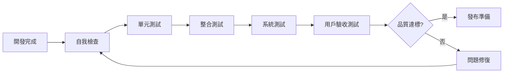

# 品質保證清單

> ✅ **品質保證標準清單**：為 Streaming Overlay System 專案提供完整的品質檢查標準和驗收條件

## 🎯 品質保證核心原則

### 📋 **品質標準定義**
- **功能完整性** - 所有功能按需求正確實現
- **效能可靠性** - 系統在各種條件下穩定運行
- **安全性保障** - 數據和系統安全得到充分保護
- **用戶體驗優化** - 介面友善，操作流暢
- **可維護性** - 代碼結構清晰，易於維護和擴展

### 🔄 **品質檢查流程**


## 📊 **分層品質檢查標準**

### 🏗️ **第一層：代碼品質檢查**

#### 📝 **代碼結構檢查**
- [ ] **命名規範**
  - [ ] 變數和函數名稱具有描述性
  - [ ] 使用一致的命名慣例 (camelCase/PascalCase)
  - [ ] 避免縮寫和模糊命名
  - [ ] 常數使用大寫命名

- [ ] **代碼組織**
  - [ ] 函數長度合理 (< 50 行)
  - [ ] 類別職責單一明確
  - [ ] 模組化設計，低耦合高內聚
  - [ ] 適當的註解和文檔

- [ ] **錯誤處理**
  - [ ] 所有可能的錯誤情況都有處理
  - [ ] 錯誤訊息清晰有用
  - [ ] 適當的日誌記錄
  - [ ] 優雅的降級處理

#### 🔒 **安全性檢查**
- [ ] **輸入驗證**
  - [ ] 所有用戶輸入都經過驗證
  - [ ] SQL 注入防護
  - [ ] XSS 攻擊防護
  - [ ] CSRF 保護機制

- [ ] **認證授權**
  - [ ] 適當的身份驗證機制
  - [ ] 權限檢查完整
  - [ ] 敏感資料加密存儲
  - [ ] API 端點安全保護

- [ ] **資料保護**
  - [ ] 敏感資訊不在日誌中洩露
  - [ ] 環境變數管理敏感配置
  - [ ] HTTPS 強制使用
  - [ ] 資料傳輸加密

### 🧪 **第二層：功能測試檢查**

#### ⚡ **單元測試標準**
- [ ] **測試覆蓋率**
  - [ ] 代碼覆蓋率 ≥ 80%
  - [ ] 關鍵業務邏輯覆蓋率 ≥ 95%
  - [ ] 邊界條件測試完整
  - [ ] 異常情況測試充分

- [ ] **測試品質**
  - [ ] 測試案例獨立性
  - [ ] 測試資料隔離
  - [ ] 測試結果可重現
  - [ ] 測試執行速度合理

#### 🔗 **整合測試標準**
- [ ] **API 測試**
  - [ ] 所有 API 端點測試
  - [ ] 請求/響應格式驗證
  - [ ] 錯誤狀態碼測試
  - [ ] API 版本相容性

- [ ] **資料庫測試**
  - [ ] CRUD 操作測試
  - [ ] 事務處理測試
  - [ ] 資料一致性驗證
  - [ ] 效能基準測試

- [ ] **第三方整合測試**
  - [ ] YouTube API 整合測試
  - [ ] Twitch API 整合測試
  - [ ] 支付系統整合測試
  - [ ] 錯誤處理和重試機制

### 🚀 **第三層：系統測試檢查**

#### 📈 **效能測試標準**
- [ ] **響應時間**
  - [ ] API 響應時間 < 2 秒
  - [ ] 頁面載入時間 < 3 秒
  - [ ] 資料庫查詢時間 < 1 秒
  - [ ] WebSocket 連接延遲 < 100ms

- [ ] **負載測試**
  - [ ] 並發用戶數測試 (目標: 1000 用戶)
  - [ ] 高峰流量處理能力
  - [ ] 資源使用率監控
  - [ ] 系統穩定性驗證

- [ ] **壓力測試**
  - [ ] 極限負載測試
  - [ ] 記憶體洩漏檢查
  - [ ] 長時間運行穩定性
  - [ ] 恢復能力測試

#### 🔄 **可靠性測試**
- [ ] **容錯能力**
  - [ ] 網路中斷恢復測試
  - [ ] 服務重啟恢復測試
  - [ ] 資料庫連接失敗處理
  - [ ] 第三方服務不可用處理

- [ ] **資料完整性**
  - [ ] 資料備份和恢復
  - [ ] 事務回滾測試
  - [ ] 併發操作資料一致性
  - [ ] 資料遷移驗證

## 🎨 **用戶體驗品質檢查**

### 💻 **前端品質標準**

#### 🎯 **介面設計檢查**
- [ ] **視覺設計**
  - [ ] 設計一致性 (顏色、字體、間距)
  - [ ] 響應式設計適配
  - [ ] 無障礙設計考量
  - [ ] 品牌識別一致性

- [ ] **互動體驗**
  - [ ] 操作回饋及時明確
  - [ ] 載入狀態提示
  - [ ] 錯誤訊息友善
  - [ ] 操作流程順暢

#### 📱 **跨平台相容性**
- [ ] **瀏覽器相容性**
  - [ ] Chrome (最新版本)
  - [ ] Firefox (最新版本)
  - [ ] Safari (最新版本)
  - [ ] Edge (最新版本)

- [ ] **設備相容性**
  - [ ] 桌面電腦 (1920x1080+)
  - [ ] 筆記型電腦 (1366x768+)
  - [ ] 平板電腦 (768x1024+)
  - [ ] 手機 (375x667+)

### 🔄 **即時功能品質檢查**

#### ⚡ **WebSocket 連接品質**
- [ ] **連接穩定性**
  - [ ] 自動重連機制
  - [ ] 連接狀態指示
  - [ ] 心跳檢測機制
  - [ ] 連接超時處理

- [ ] **資料同步**
  - [ ] 即時資料更新
  - [ ] 資料一致性保證
  - [ ] 衝突解決機制
  - [ ] 離線資料同步

#### 🎥 **直播整合品質**
- [ ] **YouTube 整合**
  - [ ] 直播狀態即時更新
  - [ ] 觀眾數據準確性
  - [ ] 聊天室訊息同步
  - [ ] 多直播切換流暢

- [ ] **Twitch 整合**
  - [ ] 頻道資訊同步
  - [ ] 追隨者通知
  - [ ] 訂閱事件處理
  - [ ] API 限制處理

## 💰 **金流系統品質檢查**

### 🔒 **安全性檢查**
- [ ] **支付安全**
  - [ ] PCI DSS 合規性
  - [ ] 敏感資料加密
  - [ ] 支付資訊不存儲
  - [ ] 安全傳輸協議

- [ ] **交易完整性**
  - [ ] 交易狀態追蹤
  - [ ] 重複支付防護
  - [ ] 退款處理機制
  - [ ] 交易記錄完整

### 💳 **支付流程檢查**
- [ ] **用戶體驗**
  - [ ] 支付流程簡潔
  - [ ] 支付狀態清晰
  - [ ] 錯誤處理友善
  - [ ] 收據和確認

- [ ] **系統整合**
  - [ ] 支付成功回調
  - [ ] 失敗處理機制
  - [ ] 狀態同步準確
  - [ ] 通知機制完整

## 🔧 **部署品質檢查**

### 🚀 **部署準備檢查**
- [ ] **環境配置**
  - [ ] 生產環境配置正確
  - [ ] 環境變數設置完整
  - [ ] 資料庫遷移腳本
  - [ ] 靜態資源優化

- [ ] **監控設置**
  - [ ] 應用效能監控
  - [ ] 錯誤追蹤系統
  - [ ] 日誌收集配置
  - [ ] 告警機制設置

### 📊 **上線後檢查**
- [ ] **功能驗證**
  - [ ] 核心功能正常運行
  - [ ] 第三方整合正常
  - [ ] 資料庫連接正常
  - [ ] 靜態資源載入正常

- [ ] **效能監控**
  - [ ] 響應時間符合預期
  - [ ] 資源使用率正常
  - [ ] 錯誤率在可接受範圍
  - [ ] 用戶體驗指標良好

## 📋 **模組特定品質檢查**

### 🏗️ **01-基礎系統架構**
- [ ] **專案結構**
  - [ ] 目錄結構清晰合理
  - [ ] 配置文件完整
  - [ ] 依賴管理正確
  - [ ] 建置腳本可用

- [ ] **開發環境**
  - [ ] 本地開發環境可啟動
  - [ ] 熱重載功能正常
  - [ ] 調試工具配置
  - [ ] 代碼格式化工具

### 🔄 **02-即時通訊系統**
- [ ] **WebSocket 功能**
  - [ ] 連接建立成功
  - [ ] 訊息發送接收正常
  - [ ] 連接斷開重連
  - [ ] 多客戶端支援

- [ ] **資料同步**
  - [ ] 即時資料更新
  - [ ] 狀態同步準確
  - [ ] 衝突處理機制
  - [ ] 效能表現良好

### 🎥 **03-05-平台整合模組**
- [ ] **API 整合**
  - [ ] 認證流程正確
  - [ ] 資料獲取準確
  - [ ] 錯誤處理完善
  - [ ] 速率限制遵守

- [ ] **資料處理**
  - [ ] 資料格式轉換正確
  - [ ] 快取機制有效
  - [ ] 資料驗證完整
  - [ ] 異常處理適當

### 💰 **06-07-金流模組**
- [ ] **支付處理**
  - [ ] 支付流程完整
  - [ ] 金額計算正確
  - [ ] 交易狀態準確
  - [ ] 安全性符合標準

- [ ] **進度追蹤**
  - [ ] 目標設定功能
  - [ ] 進度計算準確
  - [ ] 視覺化顯示
  - [ ] 歷史記錄完整

### 🔐 **08-系統管理**
- [ ] **用戶管理**
  - [ ] 註冊登入流程
  - [ ] 權限控制正確
  - [ ] 用戶資料管理
  - [ ] 安全性保護

- [ ] **系統監控**
  - [ ] 系統狀態監控
  - [ ] 效能指標收集
  - [ ] 告警機制運作
  - [ ] 日誌記錄完整

### 🚀 **09-進階功能**
- [ ] **客製化功能**
  - [ ] 個人化設定
  - [ ] 主題切換功能
  - [ ] 佈局自定義
  - [ ] 功能擴展性

- [ ] **整合功能**
  - [ ] 模組間整合
  - [ ] 資料流暢通
  - [ ] 功能協調性
  - [ ] 整體用戶體驗

## 🎯 **驗收標準**

### ✅ **功能驗收標準**
```markdown
每個功能必須滿足：
- 功能需求 100% 實現
- 錯誤處理完善
- 效能指標達標
- 安全性檢查通過
- 用戶體驗良好
```

### 📊 **品質指標標準**
```markdown
系統整體品質指標：
- 代碼覆蓋率 ≥ 80%
- API 響應時間 < 2s
- 頁面載入時間 < 3s
- 系統可用性 ≥ 99.5%
- 錯誤率 < 1%
```

### 🔒 **安全性驗收標準**
```markdown
安全性要求：
- 所有輸入驗證完整
- 敏感資料加密保護
- 認證授權機制完善
- 安全漏洞掃描通過
- 合規性檢查通過
```

## 📝 **品質檢查記錄模板**

### 📋 **檢查記錄表**
```markdown
## 品質檢查記錄

**模組名稱**: [模組名稱]
**檢查日期**: [YYYY-MM-DD]
**檢查人員**: [檢查人員]
**版本**: [版本號]

### 檢查結果
- [ ] 代碼品質檢查
- [ ] 功能測試檢查
- [ ] 效能測試檢查
- [ ] 安全性檢查
- [ ] 用戶體驗檢查

### 發現問題
1. [問題描述] - [嚴重程度] - [負責人] - [預計修復時間]
2. [問題描述] - [嚴重程度] - [負責人] - [預計修復時間]

### 整體評估
- **品質等級**: A/B/C/D
- **建議**: [改進建議]
- **是否通過**: 是/否
```

## 🔄 **持續改進機制**

### 📈 **品質指標追蹤**
```markdown
定期追蹤指標：
- 缺陷密度趨勢
- 測試覆蓋率變化
- 效能指標趨勢
- 用戶滿意度評分
- 系統可用性統計
```

### 🎯 **改進行動計畫**
```markdown
基於品質檢查結果：
1. 識別品質薄弱環節
2. 制定改進計畫
3. 實施改進措施
4. 驗證改進效果
5. 更新品質標準
```

---

## 🎯 總結

此品質保證清單提供了 Streaming Overlay System 專案的完整品質檢查標準，包括：

- ✅ **多層次品質檢查** - 從代碼到系統的全面檢查
- ✅ **模組化檢查標準** - 針對不同模組的專門標準
- ✅ **量化品質指標** - 可測量的品質標準
- ✅ **持續改進機制** - 品質持續提升的保障
- ✅ **標準化流程** - 一致的品質檢查流程

遵循此清單，能夠確保專案交付高品質的產品。

---

*此文檔遵循 Universal AI Vibe Coding 文檔標準 v2.0*
