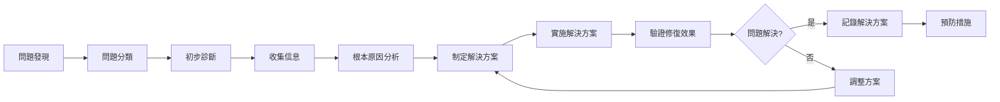

# 故障排除指南

> 🔧 **故障排除完整指南**：為 Streaming Overlay System 專案提供系統化的問題診斷和解決方案

## 🎯 故障排除核心原則

### 📋 **診斷原則**
- **系統化診斷** - 按照標準流程逐步排查
- **根本原因分析** - 找出問題的根本原因而非症狀
- **快速恢復** - 優先恢復系統功能，再進行深度分析
- **預防為主** - 從故障中學習，建立預防機制
- **文檔記錄** - 詳細記錄問題和解決過程

### 🔄 **故障排除流程**


## 🚨 **問題分類系統**

### 🔴 **系統級問題 (System Level)**
```markdown
影響範圍：整個系統不可用
緊急程度：🔥 緊急
處理時間：< 1 小時
範例：
- 服務器完全無法訪問
- 資料庫連接完全失敗
- 認證系統崩潰
- 支付系統故障
```

### 🟡 **模組級問題 (Module Level)**
```markdown
影響範圍：特定功能模組不可用
緊急程度：⚠️ 重要
處理時間：< 4 小時
範例：
- YouTube 整合失效
- WebSocket 連接問題
- 特定 API 端點故障
- 前端組件渲染錯誤
```

### 🟢 **功能級問題 (Feature Level)**
```markdown
影響範圍：個別功能異常
緊急程度：💡 一般
處理時間：< 24 小時
範例：
- 特定按鈕無響應
- 資料顯示不正確
- 樣式渲染問題
- 非關鍵功能異常
```

### 🔵 **用戶級問題 (User Level)**
```markdown
影響範圍：個別用戶遇到問題
緊急程度：📝 低
處理時間：< 72 小時
範例：
- 個人設定無法保存
- 特定瀏覽器相容性
- 用戶操作困惑
- 個人化功能異常
```

## 🔧 **通用診斷工具和方法**

### 🛠️ **基礎診斷工具**

#### 📊 **系統狀態檢查**
```bash
# 系統資源檢查
top                    # CPU 和記憶體使用率
df -h                  # 磁碟空間使用情況
free -m                # 記憶體使用詳情
netstat -tulpn         # 網路連接狀態

# 服務狀態檢查
systemctl status nginx        # Nginx 狀態
systemctl status node-app     # Node.js 應用狀態
systemctl status mongodb      # MongoDB 狀態
systemctl status redis        # Redis 狀態
```

#### 📝 **日誌分析**
```bash
# 應用日誌檢查
tail -f /var/log/app/error.log     # 即時錯誤日誌
tail -f /var/log/app/access.log    # 訪問日誌
grep "ERROR" /var/log/app/*.log    # 搜尋錯誤訊息

# 系統日誌檢查
journalctl -u nginx -f            # Nginx 服務日誌
journalctl -u node-app -f          # Node.js 應用日誌
dmesg | tail                       # 系統核心訊息
```

#### 🌐 **網路診斷**
```bash
# 連接測試
ping google.com                    # 網路連通性
curl -I https://api.youtube.com    # API 可用性測試
nslookup domain.com                # DNS 解析測試
telnet localhost 3000              # 端口連接測試

# 防火牆檢查
ufw status                         # Ubuntu 防火牆狀態
iptables -L                        # 防火牆規則列表
```

### 🔍 **進階診斷方法**

#### 📊 **效能分析**
```javascript
// Node.js 效能監控
const performanceObserver = new PerformanceObserver((list) => {
  list.getEntries().forEach((entry) => {
    console.log(`${entry.name}: ${entry.duration}ms`);
  });
});
performanceObserver.observe({ entryTypes: ['measure'] });

// 記憶體使用監控
setInterval(() => {
  const memUsage = process.memoryUsage();
  console.log('Memory Usage:', {
    rss: Math.round(memUsage.rss / 1024 / 1024) + ' MB',
    heapTotal: Math.round(memUsage.heapTotal / 1024 / 1024) + ' MB',
    heapUsed: Math.round(memUsage.heapUsed / 1024 / 1024) + ' MB'
  });
}, 30000);
```

#### 🔄 **資料庫診斷**
```javascript
// MongoDB 連接診斷
const mongoose = require('mongoose');

mongoose.connection.on('connected', () => {
  console.log('MongoDB connected successfully');
});

mongoose.connection.on('error', (err) => {
  console.error('MongoDB connection error:', err);
});

mongoose.connection.on('disconnected', () => {
  console.log('MongoDB disconnected');
});

// 查詢效能分析
db.collection.find().explain("executionStats");
```

## 🏗️ **模組特定故障排除**

### 🏗️ **01-基礎系統架構問題**

#### 🚨 **服務啟動失敗**
```markdown
症狀：應用無法啟動或立即崩潰

診斷步驟：
1. 檢查端口是否被占用
   ```bash
   lsof -i :3000
   netstat -tulpn | grep 3000
   ```

2. 檢查環境變數配置
   ```bash
   echo $NODE_ENV
   cat .env
   ```

3. 檢查依賴安裝
   ```bash
   npm list --depth=0
   npm audit
   ```

解決方案：
- 終止占用端口的進程：`kill -9 <PID>`
- 重新安裝依賴：`rm -rf node_modules && npm install`
- 檢查並修正環境變數配置
- 使用不同端口：修改 PORT 環境變數
```

#### 🔧 **配置文件問題**
```markdown
症狀：應用啟動但功能異常

診斷步驟：
1. 驗證 JSON 配置語法
   ```bash
   node -e "console.log(JSON.parse(require('fs').readFileSync('config.json')))"
   ```

2. 檢查配置文件權限
   ```bash
   ls -la config/
   ```

3. 驗證配置值
   ```javascript
   const config = require('./config');
   console.log('Config loaded:', config);
   ```

解決方案：
- 修正 JSON 語法錯誤
- 調整文件權限：`chmod 644 config.json`
- 補充缺失的配置項
- 使用配置驗證工具
```

### 🔄 **02-即時通訊系統問題**

#### ⚡ **WebSocket 連接失敗**
```markdown
症狀：客戶端無法建立 WebSocket 連接

診斷步驟：
1. 檢查 WebSocket 服務狀態
   ```javascript
   // 服務端診斷
   wss.on('connection', (ws) => {
     console.log('New WebSocket connection established');
     ws.on('error', (error) => {
       console.error('WebSocket error:', error);
     });
   });
   ```

2. 測試 WebSocket 端點
   ```bash
   # 使用 wscat 測試
   npm install -g wscat
   wscat -c ws://localhost:3000
   ```

3. 檢查代理和防火牆設置
   ```bash
   # 檢查 Nginx 配置
   nginx -t
   cat /etc/nginx/sites-available/default
   ```

解決方案：
- 重啟 WebSocket 服務
- 檢查並修正 Nginx WebSocket 代理配置
- 確認防火牆允許 WebSocket 連接
- 檢查 SSL 證書配置（WSS）
```

#### 🔄 **訊息同步問題**
```markdown
症狀：訊息發送或接收延遲/失敗

診斷步驟：
1. 檢查訊息佇列狀態
   ```javascript
   // 監控訊息處理
   const messageQueue = [];
   console.log('Queue length:', messageQueue.length);
   ```

2. 測試訊息傳輸
   ```javascript
   // 客戶端測試
   ws.send(JSON.stringify({ type: 'ping', timestamp: Date.now() }));
   ws.on('message', (data) => {
     const message = JSON.parse(data);
     console.log('Received:', message);
   });
   ```

3. 檢查記憶體使用
   ```bash
   ps aux | grep node
   ```

解決方案：
- 清理訊息佇列積壓
- 優化訊息處理邏輯
- 增加記憶體限制
- 實施訊息去重機制
```

### 🎥 **03-05-平台整合問題**

#### 🔑 **API 認證失敗**
```markdown
症狀：無法獲取 YouTube/Twitch 資料

診斷步驟：
1. 檢查 API 金鑰和權限
   ```javascript
   // 測試 API 金鑰
   const testAuth = async () => {
     try {
       const response = await fetch('https://www.googleapis.com/youtube/v3/channels?part=snippet&mine=true', {
         headers: { 'Authorization': `Bearer ${accessToken}` }
       });
       console.log('Auth status:', response.status);
     } catch (error) {
       console.error('Auth test failed:', error);
     }
   };
   ```

2. 檢查 Token 有效性
   ```bash
   # 檢查 Token 過期時間
   curl -H "Authorization: Bearer $ACCESS_TOKEN" \
        "https://www.googleapis.com/oauth2/v1/tokeninfo"
   ```

3. 驗證 API 配額
   ```javascript
   // 檢查 API 使用量
   console.log('API calls today:', apiCallCount);
   console.log('Quota limit:', quotaLimit);
   ```

解決方案：
- 重新獲取 Access Token
- 檢查 API 權限範圍 (Scopes)
- 實施 Token 自動刷新機制
- 監控和管理 API 配額使用
```

#### 📊 **資料獲取異常**
```markdown
症狀：API 返回錯誤或空資料

診斷步驟：
1. 檢查 API 響應
   ```javascript
   const debugAPICall = async (url) => {
     try {
       const response = await fetch(url);
       console.log('Status:', response.status);
       console.log('Headers:', response.headers);
       const data = await response.json();
       console.log('Data:', data);
     } catch (error) {
       console.error('API call failed:', error);
     }
   };
   ```

2. 驗證請求參數
   ```javascript
   // 檢查請求參數
   const params = new URLSearchParams({
     part: 'snippet,statistics',
     id: channelId,
     key: apiKey
   });
   console.log('Request params:', params.toString());
   ```

3. 檢查網路連接
   ```bash
   curl -v "https://www.googleapis.com/youtube/v3/channels?part=snippet&id=CHANNEL_ID&key=API_KEY"
   ```

解決方案：
- 修正 API 請求參數
- 處理 API 限制和錯誤響應
- 實施重試機制
- 添加資料驗證和清理
```

### 💰 **06-07-金流系統問題**

#### 🔒 **支付處理失敗**
```markdown
症狀：支付無法完成或狀態異常

診斷步驟：
1. 檢查支付服務狀態
   ```javascript
   // Stripe 狀態檢查
   const stripe = require('stripe')(process.env.STRIPE_SECRET_KEY);
   
   const testConnection = async () => {
     try {
       const account = await stripe.account.retrieve();
       console.log('Stripe account:', account.id);
     } catch (error) {
       console.error('Stripe connection failed:', error);
     }
   };
   ```

2. 驗證支付配置
   ```javascript
   // 檢查環境變數
   console.log('Payment config:', {
     stripePublishableKey: process.env.STRIPE_PUBLISHABLE_KEY ? 'Set' : 'Missing',
     stripeSecretKey: process.env.STRIPE_SECRET_KEY ? 'Set' : 'Missing',
     webhookSecret: process.env.STRIPE_WEBHOOK_SECRET ? 'Set' : 'Missing'
   });
   ```

3. 檢查 Webhook 設置
   ```bash
   # 測試 Webhook 端點
   curl -X POST http://localhost:3000/webhook/stripe \
        -H "Content-Type: application/json" \
        -d '{"test": true}'
   ```

解決方案：
- 驗證支付服務 API 金鑰
- 檢查 Webhook 端點配置
- 實施支付狀態同步機制
- 添加支付失敗重試邏輯
```

#### 💳 **交易狀態同步問題**
```markdown
症狀：支付成功但系統狀態未更新

診斷步驟：
1. 檢查 Webhook 日誌
   ```javascript
   // Webhook 處理監控
   app.post('/webhook/stripe', (req, res) => {
     console.log('Webhook received:', req.body.type);
     console.log('Event ID:', req.body.id);
     // 處理邏輯...
   });
   ```

2. 驗證資料庫更新
   ```javascript
   // 檢查交易記錄
   const transaction = await Transaction.findOne({ stripePaymentId: paymentId });
   console.log('Transaction status:', transaction?.status);
   ```

3. 檢查事件處理佇列
   ```javascript
   // 監控事件佇列
   console.log('Pending events:', eventQueue.length);
   ```

解決方案：
- 修復 Webhook 事件處理邏輯
- 實施事件重複處理檢查
- 添加交易狀態手動同步功能
- 建立交易狀態監控告警
```

### 🔐 **08-系統管理問題**

#### 👤 **用戶認證問題**
```markdown
症狀：用戶無法登入或權限異常

診斷步驟：
1. 檢查認證服務
   ```javascript
   // JWT Token 驗證
   const jwt = require('jsonwebtoken');
   
   const verifyToken = (token) => {
     try {
       const decoded = jwt.verify(token, process.env.JWT_SECRET);
       console.log('Token valid:', decoded);
       return decoded;
     } catch (error) {
       console.error('Token verification failed:', error.message);
       return null;
     }
   };
   ```

2. 檢查用戶資料
   ```javascript
   // 用戶資料驗證
   const user = await User.findById(userId);
   console.log('User status:', {
     id: user?.id,
     email: user?.email,
     status: user?.status,
     permissions: user?.permissions
   });
   ```

3. 檢查 Session 存儲
   ```bash
   # Redis Session 檢查
   redis-cli
   KEYS "sess:*"
   GET "sess:session_id"
   ```

解決方案：
- 重新生成 JWT Secret
- 清理過期 Session
- 修復用戶權限配置
- 實施 Session 清理機制
```

#### 📊 **系統監控異常**
```markdown
症狀：監控數據不準確或缺失

診斷步驟：
1. 檢查監控服務
   ```javascript
   // 監控數據收集
   const collectMetrics = () => {
     const metrics = {
       timestamp: Date.now(),
       memory: process.memoryUsage(),
       uptime: process.uptime(),
       activeConnections: wss.clients.size
     };
     console.log('Metrics:', metrics);
     return metrics;
   };
   ```

2. 驗證數據存儲
   ```javascript
   // 檢查監控數據
   const recentMetrics = await Metrics.find()
     .sort({ timestamp: -1 })
     .limit(10);
   console.log('Recent metrics count:', recentMetrics.length);
   ```

3. 檢查告警配置
   ```javascript
   // 告警規則檢查
   const checkAlerts = (metrics) => {
     if (metrics.memory.heapUsed > MEMORY_THRESHOLD) {
       console.log('Memory alert triggered');
     }
   };
   ```

解決方案：
- 重啟監控服務
- 修復數據收集邏輯
- 調整告警閾值
- 實施監控數據備份
```

## 🔄 **常見問題快速解決方案**

### ⚡ **快速修復清單**

#### 🚨 **緊急問題 (< 5 分鐘)**
```markdown
1. 服務無響應
   - 重啟應用：`pm2 restart app`
   - 檢查端口：`lsof -i :3000`
   - 重啟 Nginx：`sudo systemctl restart nginx`

2. 資料庫連接失敗
   - 重啟 MongoDB：`sudo systemctl restart mongod`
   - 檢查連接字串：確認 DATABASE_URL
   - 清理連接池：重啟應用

3. 記憶體不足
   - 重啟應用釋放記憶體
   - 清理臨時文件：`rm -rf /tmp/*`
   - 檢查記憶體洩漏：`ps aux --sort=-%mem`
```

#### ⚠️ **重要問題 (< 30 分鐘)**
```markdown
1. API 整合失效
   - 檢查 API 金鑰有效性
   - 重新獲取 Access Token
   - 檢查 API 配額使用情況
   - 實施降級處理

2. WebSocket 連接問題
   - 檢查 Nginx WebSocket 配置
   - 重啟 WebSocket 服務
   - 清理無效連接
   - 檢查防火牆設置

3. 支付系統異常
   - 檢查支付服務狀態
   - 驗證 Webhook 配置
   - 手動同步交易狀態
   - 通知受影響用戶
```

### 🛠️ **診斷腳本工具**

#### 📊 **系統健康檢查腳本**
```bash
#!/bin/bash
# system-health-check.sh

echo "=== System Health Check ==="

# 檢查系統資源
echo "1. System Resources:"
echo "CPU Usage: $(top -bn1 | grep "Cpu(s)" | awk '{print $2}' | awk -F'%' '{print $1}')"
echo "Memory Usage: $(free | grep Mem | awk '{printf("%.2f%%"), $3/$2 * 100.0}')"
echo "Disk Usage: $(df -h / | awk 'NR==2{printf "%s", $5}')"

# 檢查服務狀態
echo "2. Service Status:"
systemctl is-active nginx && echo "Nginx: Running" || echo "Nginx: Stopped"
systemctl is-active mongod && echo "MongoDB: Running" || echo "MongoDB: Stopped"
pm2 list | grep -q "online" && echo "Node.js App: Running" || echo "Node.js App: Stopped"

# 檢查端口
echo "3. Port Status:"
netstat -tulpn | grep :80 && echo "Port 80: Open" || echo "Port 80: Closed"
netstat -tulpn | grep :443 && echo "Port 443: Open" || echo "Port 443: Closed"
netstat -tulpn | grep :3000 && echo "Port 3000: Open" || echo "Port 3000: Closed"

# 檢查日誌錯誤
echo "4. Recent Errors:"
tail -n 10 /var/log/app/error.log | grep -i error | wc -l
```

#### 🔍 **應用診斷腳本**
```javascript
// app-diagnostics.js
const mongoose = require('mongoose');
const redis = require('redis');

const runDiagnostics = async () => {
  console.log('=== Application Diagnostics ===');
  
  // 1. 資料庫連接測試
  try {
    await mongoose.connect(process.env.DATABASE_URL);
    console.log('✅ MongoDB connection: OK');
  } catch (error) {
    console.log('❌ MongoDB connection: FAILED', error.message);
  }
  
  // 2. Redis 連接測試
  try {
    const client = redis.createClient();
    await client.connect();
    await client.ping();
    console.log('✅ Redis connection: OK');
    await client.quit();
  } catch (error) {
    console.log('❌ Redis connection: FAILED', error.message);
  }
  
  // 3. 環境變數檢查
  const requiredEnvVars = [
    'NODE_ENV',
    'DATABASE_URL',
    'JWT_SECRET',
    'STRIPE_SECRET_KEY',
    'YOUTUBE_API_KEY'
  ];
  
  console.log('Environment Variables:');
  requiredEnvVars.forEach(varName => {
    const value = process.env[varName];
    console.log(`${varName}: ${value ? '✅ Set' : '❌ Missing'}`);
  });
  
  // 4. API 端點測試
  const testEndpoints = [
    'http://localhost:3000/health',
    'http://localhost:3000/api/status'
  ];
  
  for (const endpoint of testEndpoints) {
    try {
      const response = await fetch(endpoint);
      console.log(`${endpoint}: ${response.status === 200 ? '✅ OK' : '❌ FAILED'}`);
    } catch (error) {
      console.log(`${endpoint}: ❌ FAILED - ${error.message}`);
    }
  }
};

runDiagnostics().then(() => process.exit(0));
```

## 📋 **故障記錄和學習**

### 📝 **故障記錄模板**
```markdown
## 故障記錄 #[編號]

**發生時間**: [YYYY-MM-DD HH:MM:SS]
**發現者**: [發現人員]
**影響範圍**: [系統/模組/功能]
**嚴重程度**: [🔴高/🟡中/🟢低]

### 問題描述
[詳細描述問題現象和影響]

### 診斷過程
1. [診斷步驟1]
2. [診斷步驟2]
3. [診斷步驟3]

### 根本原因
[問題的根本原因分析]

### 解決方案
[採用的解決方案和步驟]

### 修復時間
- **發現時間**: [HH:MM]
- **開始處理**: [HH:MM]
- **問題解決**: [HH:MM]
- **總耗時**: [X小時Y分鐘]

### 預防措施
[為防止類似問題再次發生的措施]

### 經驗教訓
[從此次故障中學到的經驗]
```

### 📊 **故障統計分析**
```markdown
定期分析項目：
- 故障頻率趨勢
- 故障類型分布
- 平均修復時間
- 重複故障模式
- 預防措施效果
```

## 🎯 **預防性維護**

### 🔄 **定期檢查清單**

#### 📅 **每日檢查**
- [ ] 系統資源使用率
- [ ] 應用服務狀態
- [ ] 錯誤日誌檢查
- [ ] 備份狀態確認

#### 📅 **每週檢查**
- [ ] 資料庫效能分析
- [ ] API 配額使用情況
- [ ] 安全更新檢查
- [ ] 監控告警回顧

#### 📅 **每月檢查**
- [ ] 系統效能基準測試
- [ ] 容量規劃評估
- [ ] 災難恢復測試
- [ ] 文檔更新維護

### 🛡️ **預防措施實施**
```markdown
1. 監控和告警
   - 設置關鍵指標監控
   - 配置自動告警機制
   - 建立告警響應流程

2. 自動化運維
   - 實施自動備份
   - 配置自動重啟機制
   - 建立自動擴容規則

3. 代碼品質保證
   - 實施代碼審查
   - 增加單元測試覆蓋率
   - 使用靜態代碼分析

4. 文檔和培訓
   - 維護故障排除文檔
   - 定期進行故障演練
   - 團隊技能培訓
```

---

## 🎯 總結

此故障排除指南提供了 Streaming Overlay System 專案的完整故障處理框架，包括：

- ✅ **系統化診斷流程** - 標準化的問題診斷和解決流程
- ✅ **分類處理策略** - 根據問題嚴重程度的分級處理
- ✅ **模組化解決方案** - 針對不同模組的專門解決方案
- ✅ **快速修復工具** - 緊急情況下的快速處理方法
- ✅ **預防性維護** - 主動預防問題發生的機制
- ✅ **學習改進機制** - 從故障中學習和持續改進

遵循此指南，能夠快速有效地診斷和解決系統問題，確保系統穩定運行。

---

*此文檔遵循 Universal AI Vibe Coding 文檔標準 v2.0*
