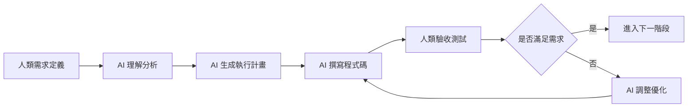

# Universal AI Vibe Coding 文檔撰寫框架

> 🤖 **通用 AI 協作文檔標準**：適用於所有 Vibe Coding 模式專案的文檔撰寫邏輯與執行框架

## 🎯 框架核心理念

### 📋 **Vibe Coding 模式定義**
- **程式碼 100% 由 AI 撰寫** - 人類負責需求定義，AI 負責實現
- **文檔雙向可讀** - 人類能理解邏輯，AI 能執行操作
- **漸進式開發** - 模組化設計，每階段獨立可用
- **品質導向** - 確保每個階段的交付品質

### 🔄 **協作流程設計**


## 📚 文檔架構標準

### 🏗️ **三層文檔架構**

#### 第一層：專案總覽 (Project Overview)
```markdown
00-[專案名稱]-project-overview.md
├── 專案定位與目標
├── 技術架構決策
├── 開發階段規劃
├── 資源與風險評估
└── 品質標準定義
```

#### 第二層：階段執行指南 (Phase Implementation Guides)
```markdown
01-[階段名稱]-implementation-guide.md
├── 🔄 前置需求檢查
├── 🎯 階段目標與交付成果
├── 🔧 詳細執行步驟
├── ✅ 完成驗證機制
└── 🔄 下一階段銜接
```

#### 第三層：支援文檔 (Supporting Documents)
```markdown
support/
├── AI-Execution-Guidelines.md           # AI 執行指導
├── Error-Handling-Playbook.md          # 錯誤處理手冊
├── Quality-Assurance-Checklist.md      # 品質保證清單
└── Troubleshooting-Guide.md            # 故障排除指南
```

## 🤖 AI 友善文檔標準

### 📋 **標準文檔模板**

#### 🎯 **階段執行文檔模板**
```markdown
# XX-[階段名稱] - [簡短描述]

> 🤖 **AI 使用指南**：[AI 專用的模組定位和執行策略說明]

## 🔄 前置需求檢查

### 📋 **必要條件**
- [ ] **依賴文檔**: [列出必須先完成的階段]
- [ ] **必要工具**: [列出需要的工具和權限]
- [ ] **技能需求**: [🟢簡單/🟡中等/🔴複雜] - [具體說明]
- [ ] **預估時間**: [⏱️具體時間範圍]
- [ ] **資源需求**: [CPU/記憶體/網路/API配額等]

### 🎯 **完成後可獲得**
- ✅ [具體成果1 - 可驗證的交付物]
- ✅ [具體成果2 - 可驗證的交付物]
- ✅ [具體成果3 - 可驗證的交付物]

## 🎯 本階段目標

### 🏗️ **主要任務**
[一句話描述核心目標，讓 AI 能快速理解重點]

### 📊 **完成標準**
[可量化、可驗證的完成條件清單]

### 🎨 **預期結果**
[具體的系統狀態描述或檔案結構展示]

## 🔧 詳細執行步驟

### 🚨 第一步：[步驟名稱]
**位置**: [執行環境 - 本地/Cloud Shell/瀏覽器等]
**目標**: [此步驟的具體目標]
**🎯 用戶情境**: 🟢 BEGINNER | 🟡 INTERMEDIATE | 🔴 ADVANCED

#### 💻 1.1 [子步驟名稱]
```bash
# 📋 CHECKLIST - [操作說明]
[具體可執行的命令]
```

**🔍 驗證方法**：
```bash
# 💻 COMMAND - 驗證指令
[驗證命令]
# 預期結果：[具體描述預期看到的輸出]
```

**⚠️ 常見問題**：
- **問題**: [具體問題描述]
- **🟢 BEGINNER 解決方案**: [詳細解決步驟]
- **🟡 INTERMEDIATE 解決方案**: [簡化解決步驟]
- **🔴 ADVANCED 解決方案**: [進階解決方案]

#### 💻 1.2 [下一個子步驟]
[重複上述格式]

### ⚠️ 第二步：[下一個主要步驟]
[重複上述格式]

## ✅ 完成驗證

### 🧪 **功能測試**
[具體的測試步驟和預期結果]

### 🔍 **品質檢查**
- [ ] [檢查項目1 - 具體可驗證]
- [ ] [檢查項目2 - 具體可驗證]
- [ ] [檢查項目3 - 具體可驗證]

### 📊 **效能驗證**
[效能指標和測試方法]

## 🔄 下一步

### 🎯 **建議路徑**
**下一個階段**: [具體階段名稱] - [選擇原因說明]

### 💡 **可選擴展**
- **如果需要[功能A]**: 考慮添加 [相關階段]
- **如果需要[功能B]**: 考慮添加 [相關階段]

### 🔧 **進階配置 (可選)**
[進階使用者的額外配置選項]

## 🤖 **AI 執行注意事項**

### 🎯 **用戶情境適應**
- **🟢 BEGINNER**: [具體的指導策略和注意事項]
- **🟡 INTERMEDIATE**: [具體的指導策略和注意事項]
- **🔴 ADVANCED**: [具體的指導策略和注意事項]

### ⚠️ **常見 AI 執行錯誤**
1. **[錯誤類型1]** - [避免方法和正確做法]
2. **[錯誤類型2]** - [避免方法和正確做法]
3. **[錯誤類型3]** - [避免方法和正確做法]

### 🔄 **分段策略**
- **[內容類型1]** → [分段方法和格式]
- **[內容類型2]** → [分段方法和格式]
- **[內容類型3]** → [分段方法和格式]

### 📊 **進度管理整合**
- **階段開始時**: 檢查並更新 `.ai-execution-log/current-progress.md`
- **階段完成時**: 記錄完成狀態和下一步計畫
- **遇到問題時**: 更新問題追蹤記錄
- **用戶確認點**: 標記需要用戶確認的決策點

---

*此階段文檔遵循 Universal AI Vibe Coding 文檔標準 v1.0*
```

### 🏷️ **AI 專用標記系統**

#### 📌 **優先級標記**
```markdown
🚨 CRITICAL    - 必須執行，不可跳過，影響後續所有步驟
⚠️ IMPORTANT   - 重要步驟，建議執行，影響功能完整性
💡 OPTIONAL    - 可選步驟，根據需求決定，提升用戶體驗
🔧 ADVANCED    - 進階功能，有經驗用戶適用，增強系統能力
```

#### 🎯 **內容類型標記**
```markdown
📋 CHECKLIST      - 檢查清單，需要逐項確認
💻 COMMAND        - 可執行命令，AI 可直接提供
📝 EXPLANATION    - 說明內容，需要 AI 解釋
🔍 VERIFICATION   - 驗證步驟，確保正確性
⚠️ TROUBLESHOOTING - 故障排除，問題解決
📊 ANALYSIS       - 分析內容，數據解讀
🎨 DESIGN         - 設計決策，架構說明
```

#### 🔄 **用戶情境標記**
```markdown
🟢 BEGINNER      - 新手適用，需要詳細說明和額外驗證
🟡 INTERMEDIATE  - 中級用戶，可以簡化說明，重點指導
🔴 ADVANCED      - 進階用戶，重點說明關鍵點和最佳實務
🎯 CUSTOM        - 客製化需求，需要動態調整內容
```

## ⚡ AI 執行策略框架

### 🎯 **智能內容分發邏輯**

#### 1. **用戶情境自動識別**
```typescript
interface UserContextAnalysis {
  // 技能水平識別
  skillLevel: 'beginner' | 'intermediate' | 'advanced';
  
  // 需求類型識別
  projectType: 'web_app' | 'mobile_app' | 'api_service' | 'data_analysis' | 'automation';
  
  // 時間限制識別
  urgency: 'learning' | 'standard' | 'urgent';
  
  // 環境識別
  environment: 'local' | 'cloud_shell' | 'ci_cd' | 'production';
}

// AI 決策邏輯
function determineExecutionStrategy(context: UserContextAnalysis): ExecutionStrategy {
  if (context.skillLevel === 'beginner') {
    return {
      explanationLevel: 'detailed',
      verificationSteps: 'extensive',
      errorHandling: 'comprehensive',
      encouragement: 'frequent'
    };
  }
  
  if (context.urgency === 'urgent') {
    return {
      explanationLevel: 'minimal',
      verificationSteps: 'essential',
      errorHandling: 'quick_fix',
      encouragement: 'minimal'
    };
  }
  
  // ... 其他邏輯
}
```

#### 2. **動態內容調整策略**
```markdown
🎯 AI 執行決策樹：

IF 用戶提及 "第一次" OR "新手" OR "不熟悉"
  → 啟用 🟢 BEGINNER 模式
  → 提供詳細說明和額外驗證步驟
  → 加強錯誤預防機制
  → 增加鼓勵性回饋

IF 用戶提及 "快速" OR "已經會" OR "直接"
  → 啟用 🟡 INTERMEDIATE 模式
  → 簡化說明，重點提供命令和關鍵點
  → 提供快速驗證方法
  → 重點說明注意事項

IF 用戶提及技術術語 OR 複雜需求 OR "客製化"
  → 啟用 🔴 ADVANCED 模式
  → 重點說明技術細節和最佳實務
  → 提供進階配置選項
  → 說明架構決策原因

IF 用戶回饋 "太複雜" OR "看不懂"
  → 降低複雜度，增加說明
  → 提供更多範例和圖解
  → 分解步驟為更小單位

IF 用戶回饋 "太簡單" OR "需要更多細節"
  → 提高複雜度，提供進階選項
  → 說明深層技術原理
  → 提供擴展功能建議
```

### 🔧 **執行品質保證機制**

#### 📋 **AI 自我檢查標準流程**
```markdown
每個步驟執行前 AI 必須檢查：
✅ 確認用戶當前環境和權限狀態
✅ 檢查前置條件是否完全滿足
✅ 預告可能的風險和注意事項
✅ 提供明確的執行指令和預期結果

每個步驟執行後 AI 必須確保：
✅ 提供驗證方法確保操作成功
✅ 說明下一步的邏輯關係和重要性
✅ 預告可能遇到的問題和解決路徑
✅ 提供階段性成就回饋
```

#### 🛡️ **錯誤預防和恢復標準**
```markdown
🚨 預防機制：
- 在關鍵操作前提供備份建議
- 在不可逆操作前要求用戶確認
- 提供操作前的環境和權限檢查
- 說明每個步驟的影響範圍

🔄 恢復機制：
- 為每個關鍵步驟提供回滾方法
- 建立標準化的錯誤診斷流程
- 提供常見問題的快速解決方案
- 建立錯誤嚴重程度分級處理
```

## 📊 專案類型適配指南

### 🌐 **Web 應用專案**
```markdown
適用技術棧：
- 前端：React/Vue/Angular + TypeScript
- 後端：Node.js/Python/Java + Express/FastAPI/Spring
- 資料庫：PostgreSQL/MongoDB/Firebase
- 部署：Vercel/Netlify/AWS/GCP

文檔重點：
- 強調 UI/UX 設計和響應式開發
- 重點說明 API 設計和前後端整合
- 詳細的部署和 CI/CD 流程
- 效能優化和 SEO 考量
```

### 📱 **行動應用專案**
```markdown
適用技術棧：
- 跨平台：React Native/Flutter
- 原生：Swift/Kotlin
- 後端：Firebase/AWS Amplify/自建 API
- 狀態管理：Redux/MobX/Provider

文檔重點：
- 平台特定的設定和權限
- 裝置功能整合（相機、GPS、推播等）
- App Store 發布流程
- 效能監控和當機追蹤
```

### 🔌 **API 服務專案**
```markdown
適用技術棧：
- 後端：Node.js/Python/Go/Rust
- 框架：Express/FastAPI/Gin/Actix
- 資料庫：PostgreSQL/MongoDB/Redis
- 文檔：OpenAPI/Swagger

文檔重點：
- API 設計原則和 RESTful 標準
- 認證和授權機制
- 資料驗證和錯誤處理
- API 文檔自動生成
- 負載測試和效能調優
```

### 📊 **資料分析專案**
```markdown
適用技術棧：
- 語言：Python/R/SQL
- 框架：Pandas/NumPy/Scikit-learn
- 視覺化：Matplotlib/Plotly/Tableau
- 平台：Jupyter/Google Colab/Databricks

文檔重點：
- 資料收集和清理流程
- 分析方法和統計模型
- 視覺化設計和解讀
- 結果驗證和模型評估
```

### 🤖 **自動化專案**
```markdown
適用技術棧：
- 語言：Python/JavaScript/Bash
- 框架：Selenium/Puppeteer/Playwright
- 排程：Cron/GitHub Actions/AWS Lambda
- 監控：Prometheus/Grafana

文檔重點：
- 自動化流程設計和錯誤處理
- 排程和觸發機制
- 日誌記錄和監控告警
- 維護和擴展策略
```

## 🔄 分段輸出管理標準

### 📏 **分段觸發條件**
```markdown
🎯 AI 分段決策邏輯：

內容長度觸發：
🟢 < 3000字：通常不需分段
🟡 3000-6000字：可能需要分段
🔴 > 6000字：幾乎必定分段

內容類型觸發：
📝 配置檔案 > 100行 → 使用 artifacts
💻 代碼檔案 > 200行 → 使用 artifacts
📋 教學步驟 > 4000字 → 標準對話分段
📊 分析報告 > 5000字 → 標準對話分段
```

### 🔄 **分段接續標準流程**
```markdown
🤖 Continue 執行模板：

## 📋 接續確認

我將從剛才中斷的 [具體位置] 繼續：

### 🔍 **上次完成進度**
- ✅ 已完成：[具體內容和步驟]
- 🔄 接下來：[具體內容和步驟]

### ⚡ **繼續執行**
[從確切中斷點開始的內容，保持格式一致]

### 📊 **當前進度**
整體完成度：[X%] | 剩餘內容：[預估時間/步驟]
```

## 🤖 AI 執行進度管理標準

> 🎯 **核心理念**：AI 自主管理專案執行進度，確保連續性和可追蹤性

### 📋 **AI 進度記錄檔案標準**

#### 🗂️ **標準進度記錄檔案結構**
```markdown
每個專案都應包含：
.ai-execution-log/
├── current-progress.md          # 當前執行進度
├── execution-history.md         # 完整執行歷史
├── pending-tasks.md            # 待處理任務清單
├── completed-tasks.md          # 已完成任務記錄
├── issues-tracker.md           # 問題追蹤記錄
└── next-session-plan.md        # 下次執行計畫
```

#### 📊 **current-progress.md 標準模板**
```markdown
# AI 執行進度記錄

> 🤖 **AI 自動更新**：每次執行結束時必須更新此記錄
> 📅 **最後更新**：[YYYY-MM-DD HH:MM:SS]

## 🎯 專案基本資訊
- **專案名稱**：[專案名稱]
- **專案類型**：[專案類型]
- **開始日期**：[YYYY-MM-DD]
- **當前階段**：[階段編號] - [階段名稱]

## 📊 整體進度狀況
- **完成度**：[X]% 
- **當前狀態**：🔄 進行中 | ⏸️ 暫停 | ✅ 完成 | ❌ 中止
- **預計完成**：[YYYY-MM-DD]

## 🔄 當前執行狀態

### ✅ **已完成的任務**
- [YYYY-MM-DD HH:MM] ✅ [具體任務描述] - [驗證結果]
- [YYYY-MM-DD HH:MM] ✅ [具體任務描述] - [驗證結果]

### 🔄 **正在進行的任務**
- **任務名稱**：[具體任務描述]
- **開始時間**：[YYYY-MM-DD HH:MM]
- **執行進度**：[X]%
- **下一步動作**：[具體下一步描述]
- **預期完成**：[YYYY-MM-DD HH:MM]

### ⏳ **待處理任務**
1. **[優先級]** [任務描述] - [預估時間]
2. **[優先級]** [任務描述] - [預估時間]
3. **[優先級]** [任務描述] - [預估時間]

## ⚠️ **當前問題與阻礙**
- **問題1**：[問題描述] - [影響程度] - [解決方案]
- **問題2**：[問題描述] - [影響程度] - [解決方案]

## 🎯 **下次執行重點**
1. **首要任務**：[具體任務描述]
2. **驗證項目**：[需要驗證的內容]
3. **注意事項**：[特別需要注意的事項]

## 📝 **AI 執行備註**
- [重要決策記錄]
- [特殊處理方式記錄]
- [用戶特殊要求記錄]
```

### 🔄 **AI 執行工作流程標準**

#### 📋 **每次執行開始時的檢查清單**
```markdown
🤖 AI 必須執行的開始檢查：

1. **📖 讀取進度記錄**
   - [ ] 檢查 current-progress.md 是否存在
   - [ ] 確認最後更新時間和執行狀態
   - [ ] 了解當前執行進度和待處理任務

2. **🔍 狀態確認**
   - [ ] 向用戶確認：「我看到上次執行到 [具體位置]，是否從此處繼續？」
   - [ ] 確認是否有新的需求或變更
   - [ ] 檢查是否有未解決的問題需要處理

3. **📋 任務規劃**
   - [ ] 確認本次執行的目標和範圍
   - [ ] 更新任務優先級和時間估算
   - [ ] 制定本次執行計畫
```

#### ✅ **每次執行結束時的更新標準**
```markdown
🤖 AI 必須執行的結束更新：

1. **📊 進度更新**
   - [ ] 更新 current-progress.md 中的完成任務
   - [ ] 記錄當前執行狀態和下一步計畫
   - [ ] 更新整體完成度百分比

2. **📝 歷史記錄**
   - [ ] 在 execution-history.md 中添加本次執行記錄
   - [ ] 記錄重要決策和解決的問題
   - [ ] 更新時間戳記和執行摘要

3. **🎯 下次準備**
   - [ ] 更新 next-session-plan.md
   - [ ] 標記需要用戶確認的事項
   - [ ] 預告下次執行的重點和注意事項
```

### 🎯 **AI 自主決策標準**

#### 🔄 **繼續執行的條件**
```markdown
AI 可以直接繼續執行的情況：
✅ 進度記錄清晰且無衝突
✅ 沒有需要用戶確認的重大變更
✅ 當前任務在預期範圍內
✅ 沒有阻礙性問題需要解決
```

#### ⚠️ **需要用戶確認的情況**
```markdown
AI 必須向用戶確認的情況：
🔴 發現進度記錄與用戶期望不符
🔴 遇到需要重大架構決策的問題
🔴 發現可能影響整體專案的風險
🔴 用戶環境或需求發生變化
🔴 執行時間超過預期需要調整計畫
```

### 📊 **進度追蹤指標標準**

#### 🎯 **量化指標**
```markdown
AI 需要追蹤的關鍵指標：
- **任務完成率**：已完成任務數 / 總任務數
- **時間效率**：實際用時 / 預估用時
- **問題解決率**：已解決問題數 / 總問題數
- **用戶滿意度**：基於用戶回饋的評分
- **代碼品質**：通過驗證的功能比例
```

#### 📈 **質化指標**
```markdown
AI 需要評估的質量指標：
- **執行流暢度**：任務間的銜接是否順暢
- **決策準確性**：AI 決策是否符合用戶期望
- **問題預防**：是否有效預防常見問題
- **學習效果**：AI 是否從執行中學習改進
- **溝通效率**：與用戶的溝通是否清晰有效
```

## 🎯 品質保證標準

### ✅ **文檔品質檢查清單**

#### 📋 **結構完整性**
- [ ] 是否遵循標準模板結構
- [ ] 是否包含所有必要的 AI 標記
- [ ] 是否有明確的前置需求檢查
- [ ] 是否有完整的驗證機制
- [ ] 是否有清晰的下一步指導

#### 💻 **執行可行性**
- [ ] 所有命令是否可直接執行
- [ ] 是否提供了充分的驗證方法
- [ ] 是否涵蓋了常見錯誤情況
- [ ] 是否有適當的錯誤處理機制
- [ ] 是否考慮了不同環境的差異

#### 🎯 **用戶體驗**
- [ ] 是否適應不同技能水平的用戶
- [ ] 是否提供了足夠的進度回饋
- [ ] 是否有合理的分段策略
- [ ] 是否包含鼓勵性和指導性內容
- [ ] 是否有清晰的成功指標

#### 🤖 **AI 友善度**
- [ ] AI 是否能準確理解執行意圖
- [ ] 是否有明確的決策邏輯指導
- [ ] 是否包含完整的情境適應策略
- [ ] 是否有標準化的錯誤處理流程
- [ ] 是否符合分段接續規範

### 📊 **效果評估指標**

#### 🎯 **量化指標**
- **AI 理解準確率**: > 95%
- **用戶執行成功率**: > 90%
- **錯誤發生率**: < 10%
- **完成時間效率**: 提升 30%+
- **用戶滿意度**: > 90%

#### 📈 **質化指標**
- **文檔清晰度**: 用戶能快速理解目標和步驟
- **執行流暢度**: 步驟間邏輯連貫，無斷層
- **問題解決能力**: 遇到問題能快速找到解決方案
- **學習效果**: 用戶能從中學習到相關知識
- **可維護性**: 文檔易於更新和擴展

## 🚀 實施指導

### 📅 **文檔開發流程**

#### 第一階段：需求分析 (1-2 天)
```markdown
1. 專案類型識別和技術棧確定
2. 用戶群體分析和技能水平評估
3. 功能模組劃分和依賴關係梳理
4. 開發階段規劃和里程碑設定
```

#### 第二階段：架構設計 (2-3 天)
```markdown
1. 文檔結構設計和模板選擇
2. AI 執行策略制定
3. 品質標準定義
4. 風險評估和應對策略
```

#### 第三階段：內容撰寫 (1-2 週)
```markdown
1. 按階段順序撰寫執行指南
2. 添加 AI 友善標記和執行指導
3. 建立驗證機制和錯誤處理
4. 完善用戶情境適應內容
```

#### 第四階段：測試優化 (3-5 天)
```markdown
1. AI 理解測試和執行驗證
2. 用戶體驗測試和回饋收集
3. 文檔內容優化和錯誤修正
4. 品質檢查和最終驗收
```

### 🔧 **維護更新機制**

#### 📊 **持續監控**
```markdown
每週監控：
- AI 執行錯誤統計和分析
- 用戶回饋收集和問題歸類
- 常見問題更新和解決方案優化

每月優化：
- 文檔內容微調和格式統一
- AI 執行策略調整和改進
- 新技術和最佳實務整合

每季檢視：
- 整體架構評估和升級規劃
- 新專案類型支援擴展
- 品質標準更新和流程改進
```

#### 🔄 **版本管理**
```markdown
版本號規則：
- 主版本 (x.0.0): 架構重大變更或新專案類型支援
- 次版本 (0.x.0): 新功能新增或重要改進
- 修訂版 (0.0.x): 錯誤修復和內容優化

更新流程：
1. 變更需求收集和評估
2. 影響範圍分析和測試計畫
3. 內容更新和品質驗證
4. 發布通知和使用指導
```

## 📚 範例應用

### 🎯 **通用專案結構範例**

基於此框架，任何專案的文檔結構都應該遵循：

```markdown
[專案名稱]/
├── 00-[專案名稱]-project-overview.md        # 專案總覽
├── 01-[階段1名稱]-implementation-guide.md   # 階段執行指南
├── 02-[階段2名稱]-implementation-guide.md   # 階段執行指南
├── 03-[階段3名稱]-implementation-guide.md   # 階段執行指南
├── ...                                      # 更多階段
├── 00-[專案名稱]-master-index.md            # 主導航索引
└── support/                                 # 支援文檔
    ├── AI-Execution-Guidelines.md           # AI 執行指導
    ├── Error-Handling-Playbook.md          # 錯誤處理手冊
    └── Troubleshooting-Guide.md            # 故障排除指南
```

每個文檔都遵循標準模板，包含：
- 🤖 AI 使用指南
- 📋 前置需求檢查
- 🔧 詳細執行步驟
- ✅完成驗證
- 🤖 AI 執行注意事項

## 🎯 總結

### ✅ **此框架提供**
1. **標準化的文檔結構** - 適用於任何專案類型
2. **AI 友善的撰寫標準** - 確保 AI 能準確理解和執行
3. **用戶情境適應機制** - 滿足不同技能水平的需求
4. **完整的品質保證體系** - 確保文檔品質和執行效果
5. **持續改進機制** - 支援長期維護和優化

### 🚀 **使用此框架的好處**
- **提升開發效率** - 標準化流程減少重複工作
- **確保交付品質** - 完整的驗證和測試機制
- **降低學習成本** - 一致的文檔結構和執行邏輯
- **支援團隊協作** - 清晰的角色分工和溝通標準
- **促進知識傳承** - 結構化的知識管理和文檔維護

### 💡 **立即行動建議**
1. **選擇一個專案開始應用此框架**
2. **按照標準模板重構現有文檔**
3. **測試 AI 理解和執行效果**
4. **收集回饋並持續優化**
5. **建立團隊使用標準和培訓機制**

---

## 🔗 相關資源

- **AI-Continue-Guidelines.md** - AI 分段接續詳細規範
- **專案範例庫** - 各種專案類型的完整框架應用示範
- **品質檢查工具** - 自動化文檔品質驗證
- **標準模板庫** - 適用於不同專案類型的標準模板

---

*此框架將隨著 AI 技術發展和專案實踐經驗持續更新優化*

**版本**: v1.0  
**最後更新**: 2025-09-25  
**適用範圍**: 所有 AI Vibe Coding 模式專案
